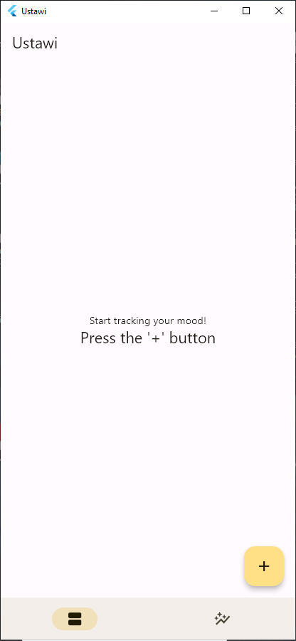

# Ustawi - Mood Tracker

A basic Mood Tracker app that uses a few taps to track and evaluate your everyday changes in mood.

Built with the Flutter Framework.

[Hive](https://github.com/hivedb/hive/tree/master/hive) for persistent storage.

[Riverpod](https://riverpod.dev) for state management and [GoRouter](https://pub.dev/packages/go_router) for routing.

## Features

- Log your daily mood
- Multiple mood entries in a day
- Graph your mood for better insights

## Screenshots

